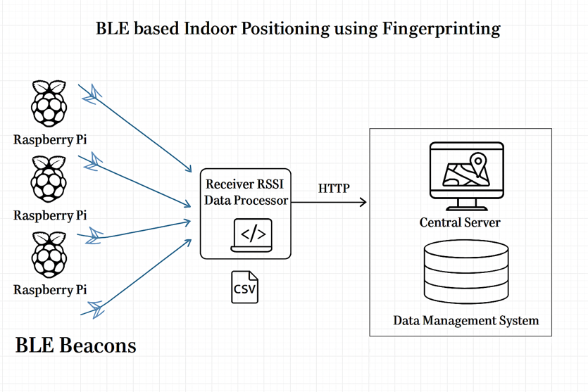
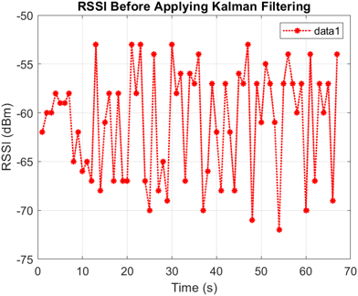
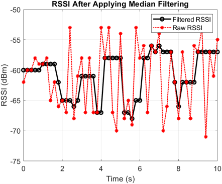

# BLE-Based Indoor Positioning System for Healthcare
A machine learning-based indoor positioning framework that improves localization accuracy in GPS-denied healthcare environments using Bluetooth Low Energy (BLE), signal processing, and fingerprinting techniques.

# Overview
Indoor positioning remains one of the biggest challenges in healthcare environments where GPS signals are unavailable or unreliable. Hospitals, rehabilitation centres, and elderly care facilities often require accurate indoor localization to improve patient safety, track medical equipment, and optimize staff workflows.

This project investigates whether Bluetooth Low Energy (BLE) fingerprinting combined with machine learning and signal processing can provide an accurate, scalable, and cost-effective indoor positioning solution.

Developed as part of a Bachelor's thesis in Computer Engineering, the system evaluates multiple signal preprocessing techniques and compares their impact on localization accuracy using the K-Nearest Neighbours (KNN) algorithm.

# The Problem
GPS performs poorly inside buildings due to signal attenuation and multipath effects. Existing indoor positioning solutions often require expensive infrastructure or specialized hardware.
Healthcare facilities require indoor positioning systems that are:
* Accurate
* Cost-effective
* Easy to deploy
* Scalable
* Reliable in noisy environments

The challenge lies in the fact that BLE RSSI measurements fluctuate significantly due to:
* Walls and building materials
* Human movement
* Device orientation
* Environmental interference
* Signal reflections

These fluctuations reduce localization accuracy and make reliable positioning difficult.

# 💡 The Solution
This project combines BLE fingerprinting with signal filtering and machine learning to improve localization performance.
Instead of using raw RSSI values directly, the system preprocesses signal data using different filtering techniques before training the localization model.
The localization pipeline consists of:
* BLE Beacons
* RSSI Collection
* Signal Preprocessing: Raw RSSI, Median Filter, Kalman Filter
* Fingerprint Database
* K-Nearest Neighbours (KNN)
* Predicted Indoor Position

By comparing different preprocessing methods, the project evaluates how signal filtering influences localization accuracy.

# System Architecture
The proposed indoor positioning framework consists of distributed BLE receivers, a centralized data processing layer, and a machine learning localization engine.

BLE Beacons -> RSSI Collection -> Signal Filtering -> Fingerprint Database -> KNN Localization -> Predicted Position

### 1. Data Collection
Bluetooth Low Energy beacons continuously broadcast RSSI values while Raspberry Pi devices collect signal strength measurements at predefined locations.

### 2. Signal Processing
Three datasets are generated for comparison:
* Raw RSSI
* Median Filtered RSSI
* Kalman Filtered RSSI
### 3. Fingerprint Database
Processed RSSI values are stored together with their known reference positions, creating a fingerprint database used for localization.
### 4. Machine Learning
The localization engine uses the K-Nearest Neighbours algorithm to estimate unknown positions by comparing new RSSI measurements against the fingerprint database.
### 5. Evaluation
Localization accuracy is evaluated using:
* Mean localization error
* Standard deviation
* Error distribution
* Visual floorplan predictions

### Raw RSSI
Raw RSSI measurements fluctuate significantly due to environmental interference, human movement, and multipath propagation. Before localization, the signals are processed using Median and Kalman filtering to improve stability.

### Median Filter Output

### Kalman Filter Output

# Engineering Challenges
### Challenge 1 — Noisy BLE Signals

BLE RSSI measurements fluctuate naturally due to environmental interference.
Solution
Implemented Median and Kalman filtering techniques to reduce signal instability before localization.

### Challenge 2 — Position Prediction Accuracy
Raw RSSI values alone produced inconsistent predictions.

Solution
Compared multiple preprocessing pipelines to determine which approach produced the most reliable localization results.

### Challenge 3 — Robustness
Indoor environments constantly change due to moving people and obstacles.

Solution
Introduced simulated signal noise to evaluate how robust each localization model remained under degraded conditions.

## 📫 Contact
Author: Zahra Mosavi and Divine Ezeilo
GitHub: @zahra-mos, Divine-Nelson
Email:divineezeilo123@gmail.com, zahra.mos2003@gmail.com
Thesis Supervisor: Ali Hassan Sudhro.

Feel free to open issues or pull requests with questions or contributions.
