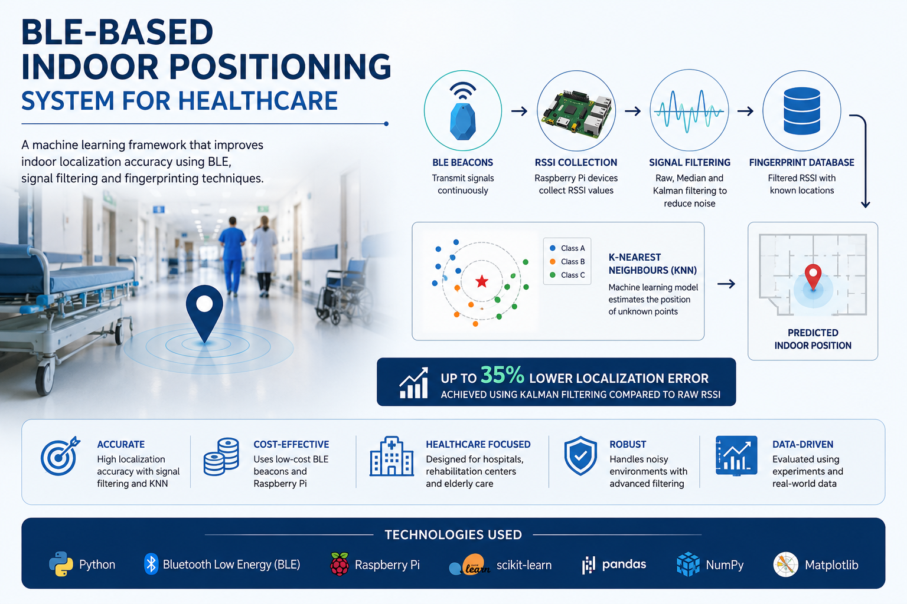
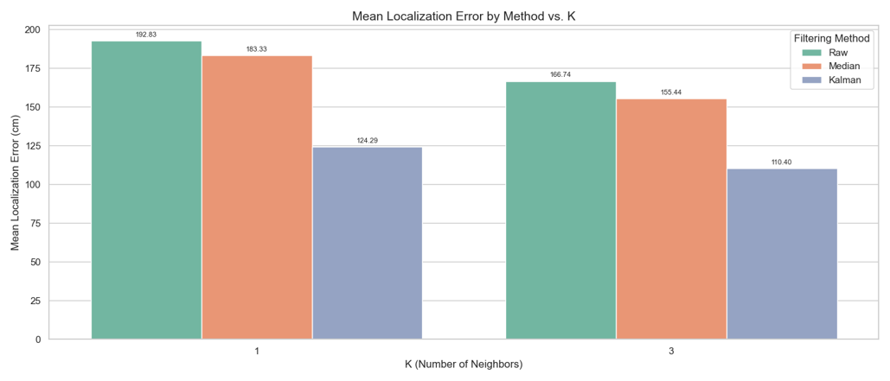
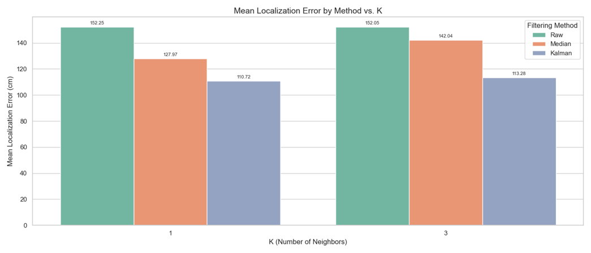

# 🏥 BLE-Based Indoor Positioning System for Healthcare

> A machine learning-based indoor positioning framework that improves indoor localization accuracy in GPS-denied healthcare environments using Bluetooth Low Energy (BLE), RSSI fingerprinting, signal processing, and K-Nearest Neighbours (KNN).




---

# 📖 Overview

Indoor positioning remains one of the biggest challenges in modern healthcare facilities where GPS signals are unavailable or unreliable. Hospitals, rehabilitation centres, and elderly care homes often require accurate indoor localization to improve patient safety, monitor medical equipment, and optimize staff workflows.

This project investigates whether **Bluetooth Low Energy (BLE) fingerprinting**, combined with **machine learning** and **signal processing**, can provide an accurate, scalable, and cost-effective indoor positioning solution.

Developed as part of a Bachelor's thesis in Computer Engineering, this framework evaluates multiple signal preprocessing techniques and compares their impact on localization accuracy using the **K-Nearest Neighbours (KNN)** algorithm.

---

# 🎯 Objectives

The primary objectives of this project are to:

- Develop a low-cost indoor positioning framework using BLE beacons.
- Reduce RSSI signal fluctuations through signal filtering.
- Evaluate the impact of preprocessing techniques on localization accuracy.
- Compare localization performance using Raw, Median, and Kalman filtered datasets.
- Investigate the suitability of BLE fingerprinting for healthcare environments.

---

# 🚨 The Problem

GPS performs poorly indoors due to signal attenuation, multipath propagation, and structural interference. Existing indoor positioning systems often require expensive infrastructure or proprietary hardware.

Healthcare facilities require localization systems that are:

- ✅ Accurate
- ✅ Cost-effective
- ✅ Scalable
- ✅ Easy to deploy
- ✅ Reliable under noisy conditions

However, BLE RSSI measurements fluctuate because of:

- Walls and building materials
- Human movement
- Device orientation
- Environmental interference
- Signal reflections (multipath propagation)

These fluctuations significantly reduce localization accuracy.

---

# 💡 Proposed Solution

The proposed framework combines **BLE fingerprinting**, **signal preprocessing**, and **machine learning** to improve indoor localization performance.

Instead of training directly on noisy RSSI measurements, the framework first preprocesses the signals using filtering techniques before generating the fingerprint database.

## Localization Pipeline

```text
BLE Beacons
      │
      ▼
RSSI Collection
      │
      ▼
Signal Preprocessing
 ├── Raw RSSI
 ├── Median Filter
 └── Kalman Filter
      │
      ▼
Fingerprint Database
      │
      ▼
K-Nearest Neighbours (KNN)
      │
      ▼
Predicted Indoor Position
```

---

# 🏗️ System Architecture

The system consists of distributed BLE receivers, a centralized processing layer, and a machine learning localization engine.


The Raspberry Pi devices continuously collect RSSI measurements from nearby BLE beacons. The collected data is processed, filtered, and transmitted to a central server where localization is performed.

---

# ⚙️ System Workflow

## 1. RSSI Data Collection

Bluetooth Low Energy beacons continuously broadcast signals while Raspberry Pi receivers collect RSSI measurements at predefined reference points.

---

## 2. Signal Processing

To reduce RSSI instability, three datasets are generated:

- Raw RSSI
- Median Filtered RSSI
- Kalman Filtered RSSI

Signal preprocessing improves the quality of the fingerprint database before machine learning is applied.

---

## 3. Fingerprint Database

Each filtered RSSI measurement is associated with a known physical location, creating a fingerprint database used during localization.

---

## 4. Machine Learning Localization

The localization engine uses **K-Nearest Neighbours (KNN)** to estimate unknown positions by comparing incoming RSSI measurements against the fingerprint database.

---

## 5. Performance Evaluation

The localization performance is evaluated using:

- Mean Localization Error
- Standard Deviation
- Error Distribution
- Floorplan Visualization

---

# 📶 Signal Processing

RSSI measurements naturally fluctuate due to environmental noise.

## Raw RSSI

Raw RSSI values contain significant fluctuations that negatively affect localization accuracy.


---

## Median Filter

The Median Filter reduces impulsive noise while preserving the overall RSSI trend.


---

## Kalman Filter

The Kalman Filter continuously estimates the optimal RSSI value, producing a much smoother signal suitable for localization.


---

# ⚡ Engineering Challenges

## Challenge 1 — RSSI Noise

### Problem

BLE RSSI values fluctuate significantly because of environmental interference.

### Solution

Implemented **Median** and **Kalman Filtering** before training the localization model.

---

## Challenge 2 — Localization Accuracy

### Problem

Using raw RSSI values resulted in inconsistent position predictions.

### Solution

Compared multiple preprocessing pipelines and evaluated their impact on KNN localization accuracy.

---

## Challenge 3 — System Robustness

### Problem

Indoor environments constantly change due to people, furniture, and signal reflections.

### Solution

Injected simulated signal noise to evaluate how each localization model performed under degraded conditions.

---

# 📊 Experimental Results

The experimental results demonstrate that signal preprocessing significantly improves localization accuracy.

## Experiment 1



Kalman filtering achieved the lowest localization error across both K values, reducing the average localization error by approximately **35%** compared to using raw RSSI measurements.

---

## Experiment 2



The second experiment confirms that signal filtering consistently improves localization performance, with Kalman filtering providing the most stable and accurate predictions.

---

# 📈 Key Findings

| Method | Performance |
|---------|------------|
| Raw RSSI | Highest localization error due to signal fluctuations |
| Median Filter | Reduced impulsive noise and improved prediction accuracy |
| Kalman Filter | Lowest localization error and most stable predictions |

## Main Conclusions

- Signal preprocessing significantly improves BLE localization performance.
- Kalman filtering consistently produced the most accurate predictions.
- Data quality had a greater impact on localization performance than increasing model complexity.
- BLE fingerprinting is a viable low-cost solution for indoor healthcare localization.

---

# 🛠️ Technologies Used

### Programming

- Python

### Machine Learning

- K-Nearest Neighbours (KNN)

### Signal Processing

- Median Filtering
- Kalman Filtering

### Hardware

- Raspberry Pi
- Bluetooth Low Energy (BLE) Beacons

### Data Analysis

- NumPy
- Pandas

### Visualization

- Matplotlib
- OpenCV

---

# 📂 Repository Structure

```text
BLE-Indoor-Positioning/

├── data/
├── images/
├── results/
├── Ref_files/
├── Test_files/
├── add_noise.py
├── kalman_filter.py
├── median_filter.py
├── KNN_Algorithms.py
├── median_filter_data.py
├── make_fb_db.py
└── README.md
```

---

# 🚀 Getting Started

```bash
git clone https://github.com/zahra-mos/ble-indoor-positioning.git

cd ble-indoor-positioning

pip install -r requirements.txt

python add_noise.py
python kalman_filter.py
python median_filter.py
python KNN_Algorithms.py
```

---

# 🔮 Future Improvements

Potential future enhancements include:

- Deep Learning-based localization models (CNNs, Transformers)
- Real-time localization dashboard
- Mobile application integration
- BLE Mesh networking
- Multi-floor localization
- Cloud deployment
- Edge AI inference on Raspberry Pi
- Real-time asset tracking for healthcare

---

# 📚 Lessons Learned

This project demonstrated that improving data quality through signal preprocessing can have a greater impact on localization performance than increasing machine learning model complexity.

Working with noisy BLE signals highlighted the importance of systematic experimentation, data engineering, and performance evaluation when designing intelligent systems for real-world environments.

Beyond machine learning, the project strengthened practical skills in:

- Software Engineering
- Embedded Systems
- Signal Processing
- Data Analysis
- Experimental Design
- Intelligent Systems Development

---

# 👨‍💻 Authors

**Divine Ezeilo**

M.Sc. AI & Automation  
B.Sc. Computer Engineering

GitHub: https://github.com/Divine-Nelson

Email: divineezeilo123@gmail.com

---

**Zahra Mosavi**

GitHub: https://github.com/zahra-mos

Email: zahra.mos2003@gmail.com

---

**Supervisor**

Dr. Ali Hassan Sudhro

---

# 📄 Research

This project was developed as part of a Bachelor's thesis in Computer Engineering at **University West**.

It demonstrates the application of **Machine Learning, Signal Processing, Embedded Systems, and Bluetooth Low Energy (BLE)** to solve real-world indoor localization challenges in healthcare.

If you found this project interesting, feel free to connect with us or explore the other projects in our engineering portfolio.
